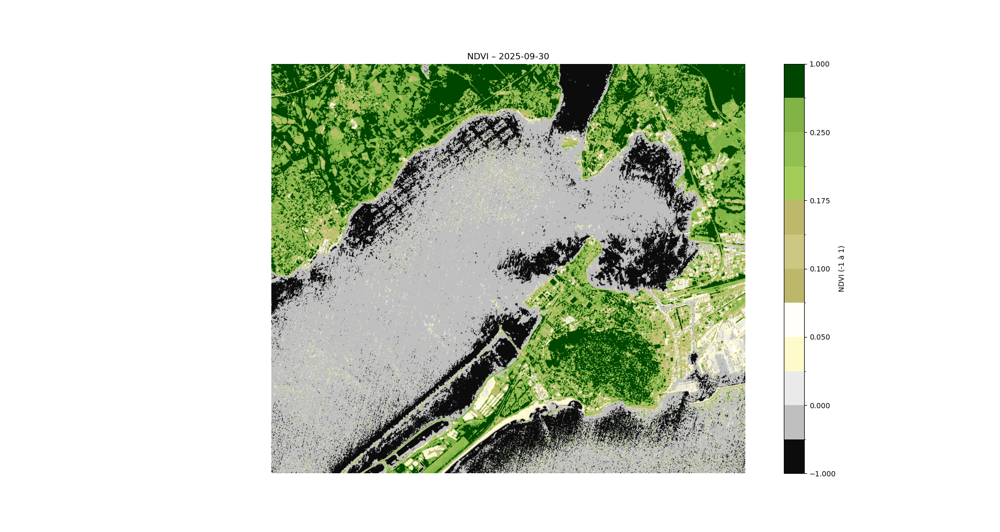

# Projet Sentinel-2. Calcul de l’indice NDVI

Ce projet illustre comment télécharger, traiter et visualiser des images Sentinel-2 pour analyser la végétation via l’indice NDVI (Normalized Difference Vegetation Index).

## Contenu
- 's2.py' : script Python principal pour charger les bandes Sentinel-2 (B04, B08), calculer le NDVI et afficher les résultats.  
- 'outputs/' : exemples de cartes NDVI générées.  
- 'data/' : dossier destiné aux fichiers '.tiff' bruts).  

## Résultats
Exemple de résultats dans le dossier 'outputs/'  

- Exemple de carte NDVI calculée à partir des bandes B04 et B08 de Sentinel-2.  
- Les zones les plus vertes indiquent une forte activité de végétation.

## Données
Les données brutes proviennent de https://browser.dataspace.copernicus.eu

## Outils utilisés
Python, Rasterio, NumPy, Matplotlib

Projet réalisé pour explorer le traitement d’images satellites et la télédétection.